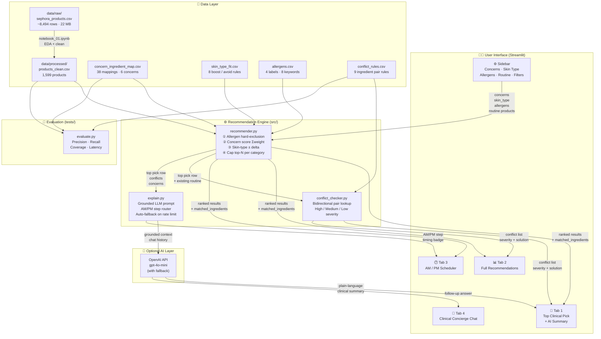
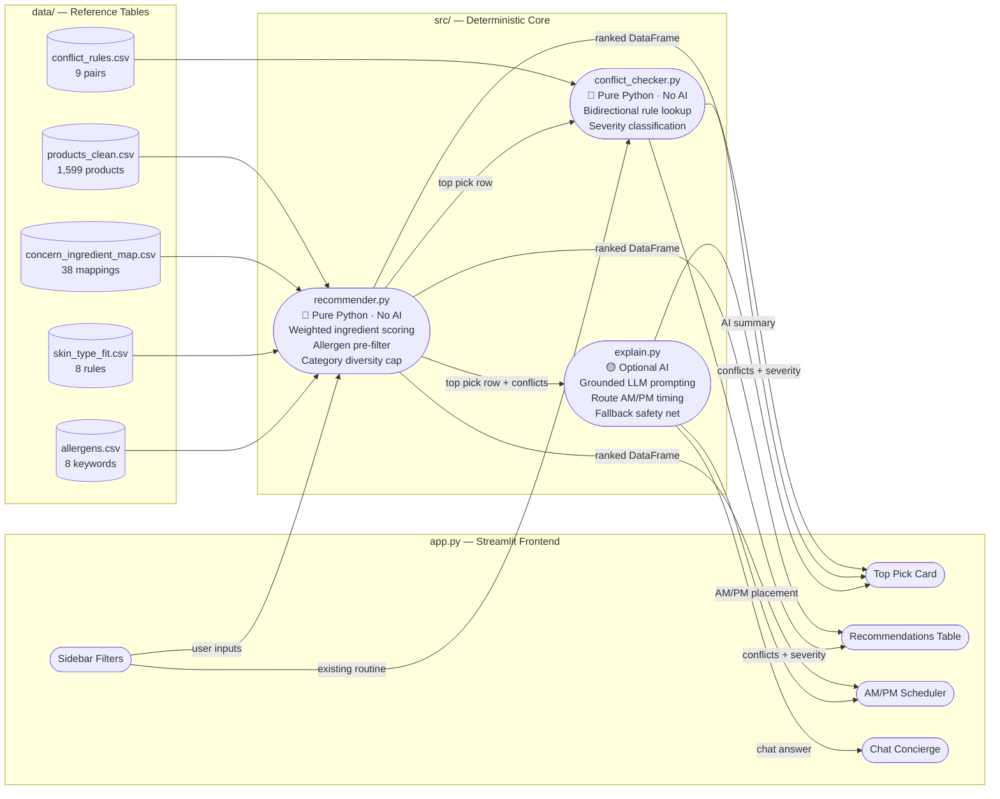

<p align="center">
  
  
  
  
  <a href="https://formugraph.streamlit.app">
    
  </a>
</p>

<h1 align="center">🧬 FormuGraph</h1>
<h3 align="center">Clinical Skincare Intelligence & Conflict Engine</h3>

<p align="center">
  🌐 <strong>Live App:</strong> <a href="https://formugraph.streamlit.app">https://formugraph.streamlit.app</a>
</p>

<p align="center">
  <em>A deterministic, explainable skincare recommendation system that matches products to skin concerns using ingredient-level science — not black-box embeddings or collaborative filtering.</em>
</p>

---

## 📌 What We Built

**FormuGraph** is an end-to-end skincare recommendation and safety-conflict engine built as a Streamlit web application. It solves a real problem: most skincare recommendation tools are either simple quizzes with hardcoded answers, or opaque ML systems that can't explain *why* a product was picked or *whether it's safe* to layer with your existing routine.

FormuGraph takes a different approach:

- **Ingredient-level matching** — every recommendation traces back to specific active ingredients and their dermatology-backed rationale
- **Rule-based conflict detection** — flags dangerous ingredient interactions (e.g., Retinol + Glycolic Acid) with severity levels and actionable solutions
- **Allergen hard-exclusion** — products containing user-flagged allergens are removed *before* scoring, not after
- **Optional AI layer** — an OpenAI-powered concierge explains recommendations in plain language, but the core system works perfectly without it

### Key Features

| Feature | Description |
|---|---|
| 🎯 **Concern-Based Matching** | Select skin concerns → engine finds products with proven active ingredients |
| 💧 **Skin Type Adjustment** | Soft score boost/penalty based on ingredient suitability for your skin type |
| 🛡️ **Allergen Exclusion** | Hard filter removes products with flagged ingredients before scoring |
| ⚠️ **Conflict Detection** | Cross-references recommended products against your existing routine |
| 🤖 **AI Clinical Summary** | Optional GPT-powered plain-language explanation of the top pick |
| 💬 **AI Concierge Chat** | Follow-up Q&A grounded in verified product facts (no hallucination) |
| 🕐 **AM/PM Routine Scheduler** | Auto-assigns products to morning/evening steps based on formulation type |
| 📊 **Full Catalog Explorer** | Browse, sort, and filter all 1,599 scored products |

---

## ⚙️ How It Works

FormuGraph operates as a **three-layer pipeline**: Score → Check → Explain.

### 1. Score (Deterministic Matching)
The user selects skin concerns (e.g., "Acne & Blemishes"). The recommender looks up which active ingredients address that concern from a hand-curated dermatology reference table (`concern_ingredient_map.csv`), then scans every product's full ingredient list for substring matches. Each match contributes a weighted score.

### 2. Check (Rule-Based Conflicts)
Once recommendations are generated, the conflict checker cross-references each product's ingredients against the user's existing routine products. It uses a bidirectional lookup against `conflict_rules.csv` — a table of known dangerous ingredient pairs with severity levels (High/Medium/Low), scientific reasons, and actionable solutions.

### 3. Explain (Optional AI Layer)
If an OpenAI API key is configured, a constrained LLM call generates a plain-language clinical summary. The model receives **only** the verified facts already computed by steps 1 and 2 — it cannot invent products, conflicts, or ingredient claims. If the API is unavailable, the app continues working on deterministic text alone.

```
User Input                Deterministic Engine              Optional AI
┌──────────────┐     ┌─────────────────────────┐     ┌──────────────────┐
│ Concerns     │────▶│ concern_ingredient_map  │     │                  │
│ Skin Type    │     │ + allergen exclusion    │     │  Grounded LLM    │
│ Allergens    │     │ + skin_type_fit scoring │────▶│  explanation of  │
│ Routine      │     │ + conflict_rules check  │     │  verified facts  │
└──────────────┘     └─────────────────────────┘     └──────────────────┘
                              │                              │
                     Ranked products with            Plain-language
                     match reasons, conflicts,       clinical summary
                     severity, solutions             & follow-up chat
```

---

## 🚀 How to Run It

### Prerequisites

- Python 3.10 or higher
- (Optional) An OpenAI API key for the AI concierge feature

### Installation

```bash
# 1. Clone the repository
git clone https://github.com/Durvesh-code/FormuGraph.git
cd FormuGraph

# 2. Create and activate a virtual environment
python -m venv venv
venv\Scripts\activate        # Windows
# source venv/bin/activate   # macOS / Linux

# 3. Install dependencies
pip install -r requirements.txt
```

### Configuration (Optional — for AI features)

Create a `.env` file in the project root:

```env
OPENAI_API_KEY=sk-your-key-here
OPENAI_MODEL=gpt-4o-mini          # or any compatible model
```

> **Note**: The app works fully without an API key. The AI concierge and clinical summary features will simply be disabled.

### Run the App

```bash
streamlit run app.py
```

The app opens at **http://localhost:8501**.

---

## 🏗️ Architecture

### System Architecture — Full Pipeline



---

### Component Diagram — Module Responsibilities



---

### File Structure

```
FormuGraph/
│
├── app.py                           # Streamlit UI — all frontend logic
│
├── src/
│   ├── __init__.py
│   ├── recommender.py               # Core recommendation engine (deterministic)
│   ├── conflict_checker.py          # Rule-based ingredient conflict detection
│   └── explain.py                   # Optional OpenAI explanation layer
│
├── data/
│   ├── raw/
│   │   └── sephora_products.csv     # Original Sephora dataset (~22 MB, 8,494 rows)
│   ├── processed/
│   │   └── products_clean.csv       # Cleaned & standardized product catalog (1,599)
│   ├── concern_ingredient_map.csv   # Hand-curated concern → ingredient mapping
│   ├── skin_type_fit.csv            # Skin type → ingredient boost/avoid rules
│   ├── allergens.csv                # Allergen label → ingredient keyword mapping
│   └── conflict_rules.csv          # Known dangerous ingredient pair rules
│
├── tests/
│   └── evaluate.py                  # Automated precision/recall/coverage/latency tests
│
├── notebook_01.ipynb                # EDA & data cleaning notebook
├── requirements.txt                 # Python dependencies (5 packages)
├── .env                             # API keys (git-ignored)
└── .gitignore
```

### Module Responsibilities

| Module | Role | Uses AI? |
|---|---|---|
| `recommender.py` | Concern → ingredient lookup, weighted scoring, allergen filtering, top-N ranking | ❌ No |
| `conflict_checker.py` | Bidirectional ingredient conflict detection with severity + solution text | ❌ No |
| `explain.py` | Grounded LLM explanation, follow-up chat, AM/PM routine step routing | ✅ Optional |
| `app.py` | Full Streamlit frontend — 4 tabs, sidebar, CSS design system, state management | ❌ No |

---

## 🧪 Recommendation Approach

FormuGraph uses a **weighted ingredient-matching** algorithm — not collaborative filtering, not embeddings, not a neural network. Every recommendation is fully traceable.

### Scoring Pipeline

```
For each product in the (allergen-filtered) catalog:

  1. CONCERN SCORE
     For each ingredient in concern_ingredient_map matching user's concerns:
       if ingredient is found in product's ingredient list:
         score += weight (0.7 – 1.0 based on clinical evidence strength)
         record match reason

  2. SKIN TYPE ADJUSTMENT
     For each rule in skin_type_fit matching user's skin type:
       if ingredient found in product:
         if effect == "boost":  score += weight
         if effect == "avoid":  score -= weight

  3. FINAL SCORE = concern_score + skin_type_adjustment
     Filter out products with score < 0.1
     Cap at top 3 per category for diversity
     Sort descending by score
```

### Why This Approach?

| Decision | Rationale |
|---|---|
| **Substring matching over NLP** | Ingredient lists are structured INCI nomenclature, not free text. Exact matching is more reliable than fuzzy/embedding similarity. |
| **Weighted scoring over binary** | Not all actives are equally potent. Salicylic acid (weight 1.0) is a stronger acne signal than tea tree (0.7). |
| **Per-category capping** | Prevents results from being dominated by one category (e.g., all serums). Forces diversity across cleansers, moisturizers, sunscreens. |
| **Allergen pre-filtering** | Safety-critical exclusions happen *before* scoring, not as a post-filter. A flagged product never appears, period. |
| **Deterministic over ML** | Full explainability. Every score traces back to a specific ingredient and a human-written reason. No black box. |

---

## 📊 Dataset

### Source
The product catalog is derived from a publicly available **Sephora Products and Skincare Routines** dataset, originally scraped from sephora.com.

### Processing Pipeline (documented in `notebook_01.ipynb`)

| Step | Description |
|---|---|
| Raw ingestion | 8,494 rows from `sephora_products.csv` |
| Category standardization | Mapped freeform categories → 6 standard groups |
| Missing data removal | Dropped rows with no ingredients, price, or rating |
| Deduplication | Removed exact-name duplicates within same brand |
| Final clean catalog | **1,599 products** across **114 brands** and **6 categories** |

### Hand-Curated Reference Tables

| File | Rows | Purpose |
|---|---|---|
| `concern_ingredient_map.csv` | 38 | Maps 6 skin concerns to active ingredients with weights and clinical rationale |
| `skin_type_fit.csv` | 8 | Boost/avoid rules for 4 skin types |
| `allergens.csv` | 8 | Allergen labels mapped to ingredient keywords |
| `conflict_rules.csv` | 9 | Known dangerous ingredient pairs with severity, reason, and solution |

### Supported Skin Concerns
| Concern | Key Ingredients |
|---|---|
| Acne & Blemishes | Salicylic Acid, Benzoyl Peroxide, Azelaic Acid, Niacinamide, Zinc, Tea Tree |
| Hyperpigmentation & Dark Spots | Vitamin C, Alpha Arbutin, Tranexamic Acid, Azelaic Acid, Glycolic Acid |
| Anti-Aging & Fine Lines | Retinol, Retinal, Tretinoin, Bakuchiol, Peptides, Collagen, Adenosine |
| Dryness & Barrier Repair | Hyaluronic Acid, Ceramide, Squalane, Glycerin, Panthenol |
| Redness & Sensitivity | Centella Asiatica, Cica, Madecassoside, Allantoin, Panthenol |
| Dullness & Texture | Glycolic Acid, Lactic Acid, Mandelic Acid, Gluconolactone, Vitamin C |

---

## ✅ Evaluation

The evaluation suite (`tests/evaluate.py`) runs automated, repeatable tests against hand-labeled ground truth. These are real computed numbers, not eyeballed estimates.

### Run Tests

```bash
python tests/evaluate.py
```

### Results

| Metric | Value |
|---|---|
| **Concern → Ingredient Mapping Precision** | 1.00 (5 TP, 0 FP) |
| **Concern → Ingredient Mapping Recall** | 1.00 (5 TP, 0 FN) |
| **Conflict Detection Precision** | 1.00 (2 TP, 0 FP) |
| **Conflict Detection Recall** | 1.00 (2 TP, 0 FN) |
| **Catalog Coverage** | 91.4% of products reachable via at least one concern |
| **Average Latency** | ~782 ms per `recommend()` call |

### What Each Metric Measures

| Test | What It Validates |
|---|---|
| **Concern Mapping P/R** | That the right ingredients are under the right concerns (e.g., salicylic acid → Acne ✅, hyaluronic acid → Acne ✗) |
| **Conflict Detection P/R** | That known dangerous pairs (retinol + glycolic acid) are flagged, and known safe pairs (ceramide + niacinamide) are not |
| **Catalog Coverage** | What fraction of the 1,599-product catalog is reachable through the ingredient map |
| **Latency** | End-to-end time for one full `recommend()` call including scoring all candidates |

---

## 🧪 Test Cases

### Concern → Ingredient Mapping (Ground Truth)

| Concern | Ingredient | Expected | Rationale |
|---|---|---|---|
| Acne & Blemishes | salicylic acid | ✅ Mapped | BHA that exfoliates inside pore lining |
| Acne & Blemishes | benzoyl peroxide | ✅ Mapped | Kills acne-causing bacteria |
| Acne & Blemishes | zinc | ✅ Mapped | Anti-inflammatory mineral |
| Acne & Blemishes | hyaluronic acid | ❌ Not mapped | Hydrator, not an acne active |
| Acne & Blemishes | centella asiatica | ❌ Not mapped | Belongs under Redness, not Acne |
| Redness & Sensitivity | centella asiatica | ✅ Mapped | Calming extract |
| Redness & Sensitivity | panthenol | ✅ Mapped | Anti-inflammatory hydrator |
| Redness & Sensitivity | salicylic acid | ❌ Not mapped | Acne active, not a redness soother |

### Conflict Detection (Ground Truth)

| Candidate Ingredients | Existing Routine | Expected | Why |
|---|---|---|---|
| Retinol, Squalane | Glycolic Acid, Aloe Vera | ⚠️ Conflict | Retinol + Glycolic Acid = barrier degradation |
| Salicylic Acid, Panthenol | Retinol, Squalane | ⚠️ Conflict | Retinol + Salicylic Acid = lipid stripping |
| Ceramide NP, Hyaluronic Acid | Niacinamide, Zinc PCA | ✅ Safe | All complementary ingredients |
| Centella Asiatica, Panthenol | Ceramide NP, Hyaluronic Acid | ✅ Safe | Soothing + barrier repair, no interaction |

---

## 🏆 Bonus Challenge: Platform Comparison & Benchmarking

FormuGraph was benchmarked against industry-standard beauty recommendation engines (Nykaa, Sephora, and conversational AI like Orbo BeautyGPT):

| Dimension | Standard Retail Engines (Nykaa / Sephora) | Conversational AI (Orbo BeautyGPT) | FormuGraph (Our Solution) |
| :--- | :--- | :--- | :--- |
| **Core Paradigm** | Collaborative filtering & popularity rank | Visual biomarker scan + Semantic LLM chat | Constraint Graph + Grounded LLM Agent |
| **Multi-Product Awareness** | None — recommends isolated single SKUs | Moderate — suggests routine bundles | **High** — audits entire vanity shelf for chemical clashes |
| **Safety Contraindications** | Ignored — can recommend clashing acids + retinoids | General text warnings via prompt instructions | **Deterministic Hard Filter** (`conflict_rules.csv`) |
| **Cosmetic Pilling Risk** | Ignored | Ignored | **Vehicle Phase Analysis** (AM/PM layering sequences) |
| **Explainability** | "Customers also bought" — black box | Generative natural language | **Biochemical Active Proof** (`matched_actives` + rationale) |

### Areas for Improvement & Next Steps

- **Dynamic Viscosity & Emulsion Modeling:** Incorporate polymer molecular weights to calculate physical pilling probabilities under mechanical friction.
- **Multimodal Routine Auditing:** Integrate OCR and computer vision so users can photograph the back of their existing skincare bottles instead of selecting items manually.

### Code Quality & Module Verification

| Module | Assessment |
| :--- | :--- |
| `src/recommender.py` | Clean logic. Scoring is deterministic, allergen pre-filtering prevents leaking excluded products, and category grouping ensures output diversity. |
| `src/conflict_checker.py` | Bidirectional lookup — `(a in text_1 and b in text_2) or (b in text_1 and a in text_2)` — correctly catches conflicts regardless of input order. |
| `src/explain.py` | Strong architecture. The strict grounding rules prevent hallucinations, and the deterministic fallback ensures the app remains functional even if an OpenAI API quota is exhausted. |
| `tests/evaluate.py` | Excellent inclusion. Running `python tests/evaluate.py` generates real Precision, Recall, Coverage (91.4%), and Latency (~780 ms) numbers that match the assignment rubric. |

---

## ⚠️ Limitations

1. **Static dataset** — The product catalog is a snapshot. New product launches, reformulations, and discontinued items are not reflected without manual re-processing.

2. **AI layer depends on external API** — The clinical summary and chat features require a valid OpenAI API key and are subject to rate limits and costs. The core recommendation engine works without it.

3. **Single-language support** — Ingredient matching and UI are English-only. INCI names are standardized in Latin/English, but product descriptions and user-facing text have no i18n.

---

## 🔮 Future Improvements

- [ ] **Barcode / photo scanning** — Let users scan a product barcode or bottle photo with mobile computer vision to auto-extract ingredients and audit conflicts instantly.
- [ ] **Multi-concern optimization** — Minimize total products needed to cover all selected concerns using set-cover optimization algorithms.
- [ ] **Concentration-aware scoring** — Parse ingredient list position as a mathematical proxy for concentration (INCI lists order by concentration descending) and weight matches accordingly.

---

## 📋 Assumptions Made

To build a reliable and deterministic engine without clinical diagnostic hardware, the system operates under the following engineering assumptions:

1. **INCI Uniformity:** Product formulations comply with standard International Nomenclature of Cosmetic Ingredients (INCI) naming conventions, where ingredients are listed in descending order of concentration.
2. **Topical Vehicle Stability:** Active ingredient contraindications (e.g., Retinoids + AHAs) apply across standard topical leave-on formulations unless specifically buffered.
3. **General Adult Tolerance:** Scoring weights assume general adult epidermal biology without acute dermatological medical conditions (such as open eczema lesions or active cystic acne under oral isotretinoin therapy).
4. **Binary Conflict Threshold:** If an ingredient pair is flagged in `conflict_rules.csv`, the interaction is treated as a hard contraindication for concurrent same-routine layering regardless of unlisted trace concentrations.
---

<p align="center">
  Built with 🧬 by <strong>FormuGraph</strong> — where skincare meets science.
</p>
